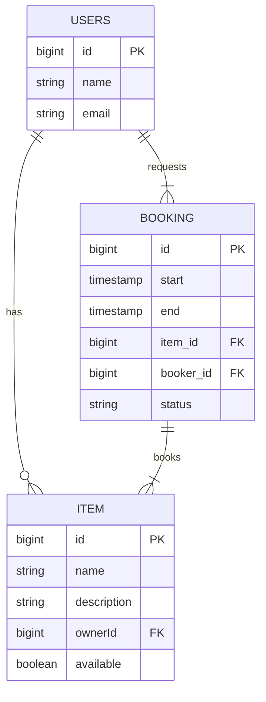

# java-shareit
Template repository for Shareit project.

## Entity Relationship

```mermaid
erDiagram
    USERS ||--o{ ITEM: has
    USERS ||--|{ BOOKING: requests
    BOOKING ||--|{ ITEM: books
    USERS {
        bigint id PK
        string name
        string email
    }
    ITEM {
        bigint id PK
        string name
        string description
        bigint ownerId FK
        boolean available
    }
    BOOKING {
        bigint id PK
        timestamp start
        timestamp end
        bigint item_id FK
        bigint booker_id FK
        string status
    }
```